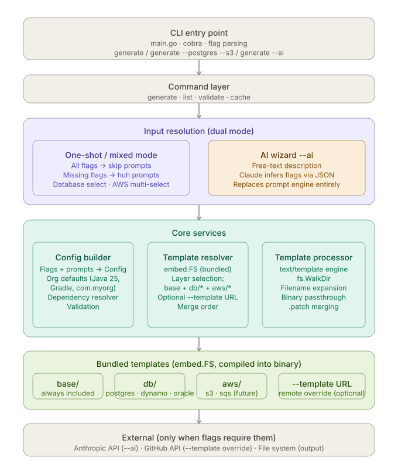

## LocalTemplate

### Design


### Building and testing locally

Requires Go 1.22+.

```bash
# fetch dependencies and generate/update go.sum
go mod tidy

# compile everything (fails fast on type errors, doesn't produce a binary)
go build ./...

# static analysis — catches common mistakes go build won't
go vet ./...

# run the CLI without building a binary first
go run . generate --dry-run --artifact my-service

# build a binary and run it directly
go build -o localTemplate .
./localTemplate generate --help
```

There's no test suite yet — `internal/config`, `internal/prompt`, and
`internal/template` are still stubs (see `docs/HANDOVER.md`). Once those are
implemented, `go test ./...` is the standard way to run tests.
